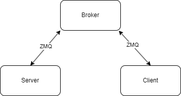
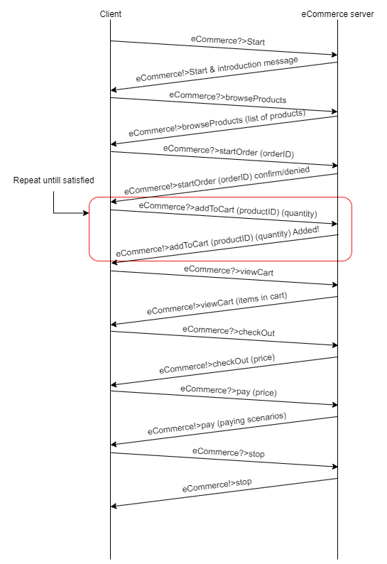

# eCommerce


## Overview

This eCommerce program allows users to browse, search for, and manage products, as well as handle orders and view order history.

## Usage (example)
To interact with the eCommerce program running on our server, follow these steps:

1. **Connect to the Server**: Use a client application to connect to the server.

2. **Send Commands**: Once connected, you can send commands to the server to perform various actions:

   - To display a list of available products:
     ```
     eCommerce>browseProducts
     ```

   - To search for products by keyword (e.g., "laptop"):
     ```
     eCommerce>searchProducts laptop
     ```

   - To add a product to the shopping cart (e.g., product ID: 12345, quantity: 2):
     ```
     eCommerce>addToCart 12345 2
     ```

   - To remove a product from the shopping cart (e.g., product ID: 54321):
     ```
     eCommerce>removeFromCart 54321
     ```

   - To view the contents of the shopping cart:
     ```
     eCommerce>viewCart
     ```

   - To process the checkout and place an order:
     ```
     eCommerce>checkout
     ```

   - To update the quantity of a product in the shopping cart:
     ```
     eCommerce>updateCartItem
     ```

   - To remove all products from the shopping cart:
     ```
     eCommerce>clearCart
     ```

   - To view details of a specific product (e.g., product ID: 12345):
     ```
     eCommerce>viewProduct 12345
     ```

   - To view a list of past orders:
     ```
     eCommerce>viewOrders
     ```

   - To cancel a specific order (e.g., order ID: 98765):
     ```
     eCommerce>cancelOrder 98765
     ```

3. **Receive Responses**: After sending a command to the server, you will receive responses indicating the outcome of your actions.

4. **Continue Interaction**: You can continue interacting with the server by sending additional commands as needed.

Feel free to explore the available commands and manage your shopping experience efficiently!

## Diagrams

Following diagram shows how the server and client communicate and work together:



Following diagram shows an example of how to interact with the server:




## Commands

1. browseProducts - Display a list of available products.
2. searchProducts (keyword) - Search for products by keyword.
3. addToCart (productId) (quantity) - Add a product to the shopping cart.
4. removeFromCart (productId) - Remove a product from the shopping cart.
5. viewCart - View the contents of the shopping cart.
6. checkout - Process the checkout and place an order.
7. help - Display available commands.
8. updateCartItem - Update the quantity of a product in the shopping cart.
9. clearCart - Remove all products from the shopping cart.
10. viewProduct (productId) - View details of a specific product.
11. startOrder (orderId) - Start a order where items can be added to
12. viewOrders - View a list of past orders.
13. cancelOrder (orderId) - Cancel a specific order.
14. pay (price) - pay after checkout
14. Start - Start the eCommerce interaction. 
15. Stop - Stop the eCommerce interaction.
