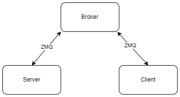

# eCommerce

## Overview

This eCommerce program allows users to browse, search for, and manage products, as well as handle orders and view order history.

## Usage (example)
To interact with the eCommerce program running on our server, follow these steps:

1. **Connect to the Server**: Use a client application to connect to the server.

2. **Send Commands**: Once connected, you can send commands to the server to perform various actions:

   - To display a list of available products:
     ```
     eCommerce?>browseProducts
     ```

   - To add a product to the shopping cart (e.g., product ID: 12345, quantity: 2):
     ```
     eCommerce?>addToCart>12345>2
     ```

   - To remove a product from the shopping cart (e.g., product ID: 54321):
     ```
     eCommerce?>removeFromCart>54321
     ```

   - To view the contents of the shopping cart:
     ```
     eCommerce?>viewCart
     ```

   - To process the checkout and place an order:
     ```
     eCommerce?>checkout
     ```

   - To update the quantity of a product in the shopping cart: (e.g., product ID: 12345, quantity: 3)
     ```
     eCommerce?>updateCartItem>12345>3
     ```

   - To remove all products from the shopping cart:
     ```
     eCommerce?>clearCart
     ```

   - To view a list of past orders:
     ```
     eCommerce?>viewOrders
     ```

   - To cancel a specific order (e.g., order ID: 98765):
     ```
     eCommerce?>cancelOrder 98765
     ```

3. **Receive Responses**: After sending a command to the server, you will receive responses indicating the outcome of your actions.

4. **Continue Interaction**: You can continue interacting with the server by sending additional commands as needed.

Feel free to explore the available commands and manage your shopping experience efficiently!

## Diagrams

The following diagram shows how the server and client communicate and work together:



The following diagram shows an example of how to interact with the server:


## Concept Commands

1. browseProducts - Display a list of available products.
2. addToCart (productId) (quantity) - Add a product to the shopping cart.
3. removeFromCart (productId) - Remove a product from the shopping cart.
4. viewCart - View the contents of the shopping cart.
5. checkout - Process the checkout and place an order.
6. help - Display available commands.
7. updateCartItem - Update the quantity of a product in the shopping cart.
8. clearCart - Remove all products from the shopping cart.
9. viewProduct (productId) - View details of a specific product.
10. viewOrders - View a list of past orders.
11. cancelOrder (orderId) - Cancel a specific order.
12. pay (price) - pay after checkout
13. Start - Start the eCommerce interaction. 
14. Stop - Stop the eCommerce interaction.

## Available Commands

1. **browseProducts**
   - **Description:** Display a list of available products.
   - **Example:** `eCommerce?>username>browseProducts`

2. **addToCart <productId> <quantity>**
   - **Description:** Add a product to the shopping cart.
   - **Example:** `eCommerce?>username>addToCart>1>2` (Add 2 units of product with ID 1 to the cart)

3. **clearCart**
   - **Description:** Remove all products from the shopping cart.
   - **Example:** `eCommerce?>username>clearCart` 

4. **viewCart**
   - **Description:** View the contents of the shopping cart.
   - **Example:** `eCommerce?>username>viewCart`

5. **checkout**
   - **Description:** Process the checkout and place an order.
   - **Example:** `eCommerce?>username>checkout`

6. **pay**
   - **Description:** Complete the payment for your order.
   - **Example:** `eCommerce?>username>pay`

7. **viewOrders**
   - **Description:** View past orders.
   - **Example:** `eCommerce?>username>viewOrders`

8. **stop**
   - **Description:** Log out and clear the cart.
   - **Example:** `eCommerce?>username>stop`


## TO DO
- [ ] add updateCartItem
- [ ] add cancelOrder
- [ ] add removeitemfromcart
